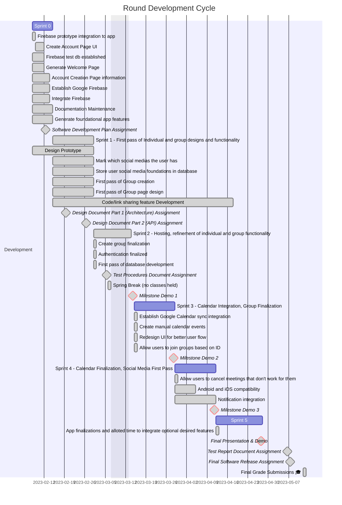

# Schedule

## Milestone 1 Deliverables:
- F1: Account Management
    - R1: User is able to register new account.
    - R2: User is able to login with an existing account.
    - R3: User is able to update their account name, profile image, and email address.
    - R4: User is able to view their account information.
    - R5: User can list all social media platforms they want to use.
- F2: Group creation
    - R1. Team creator is presented with a QR Code to invite group members.
    - R2. Team member is presented with a QR scanner to join their group.
    - R3. Users can see a list of all of their group members.
    - R4. Users can see a list of their groups.
- F3: Social Media
    - R1: User is able to broadcast the most common/prefered platform of the group

## Milestone 2 Deliverables:
- F4: Group Availability Functionality
    - R1: Upon creation of a group, the user is able to enter dates in which they are free for a group meetings.
    - R2: Group members are presented with a list of available time slots in which they could meet on a certain day.
- F5: Calendar Integration
    - R1: A user is able to import their events from calendar services iCal, Google Calendar, and Outlook from at least one calendar source.
    - R2: Able to combine multiple of the same kind of calendar
    - R3: The system should be able to add a calendar event to their associated calendar on the users behalf.
    - R4: The team should be presented with a group calendar in which they can create events.
- F6: Push notifications to user
    - R1: The system is able to notify users of an upcoming meeting.

## Milestone 3 Deliverables:
- F7: Calendar Integration
    - R1: A user can input a last minute change to their calendar, which is able to cancel an already existing time slot to meet up.
    - R2: A user can import their events from more than one calendar.
    - R3: Able to find new time if first time does not work
- F8: Push notification to user
    - R1: Able to notify user of time being cancelled, and prompt with new time
    - R2: User is notified that previous time slot was cancelled, and a new one has been found.
- F9: Social Media
    - R1: The system will create a group chat based on the groups preferred messaging platform selection.
    - R2: if the group selects a messaging service that cannot be automatically generated, the application will to generate a list of the groups, user names and copy them to the group organizer's clipboard.
    - R3: The user will be deeplinked/redirected to the groups prefered messaging platform. 
