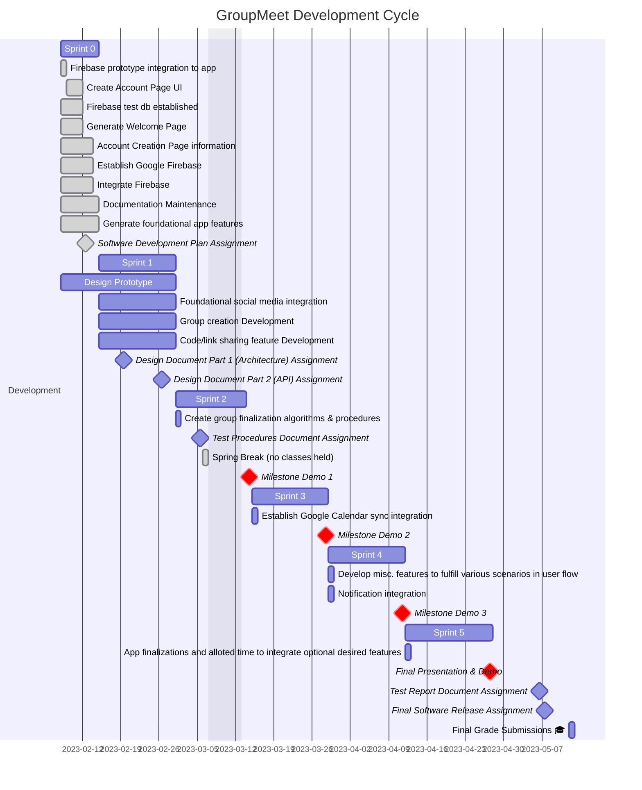

# Schedule

Milestone 1 Goals: 
| F: Login and Account Creation 
|   R: Able to register new account 
|   R: Able to login with existing account 
|   R: Able to update account 
|   R: Able to view account information 
| F: Group creation 
|   R: First pass of user accessing group 
|   R: First pass of group registration  
|   R: First pass of group creation  
| F: Social Media 
|    R: Able to view all social media accounts of all users in the groups 
|    R: Able to broadcast the most common platform 

Milestone 2 Goals: 
| F: Calendar Integration 
|    R: Able to combine multiple of the same kind of calendar 
|    R: Able to create event on calendar 
|    R: Able to recognize a free time slot 
| F: Push notifications to user 
|   R: Able to notify users of a time 
|   R: Able to prompt the user if the selected time is good 
| F: Group creation 
|   R: Second pass of Milestone 1 Requirements 

Milestone 3 Goals: 
| F: Calendar Integration 
|   R: First pass of "Unforeseen events" that cause changes in scheduling 
|   R: Able to integrate multiple calendars 
|   R: Able to find new time if first time does not work 
| : Push notification to user 
|   R: Able to notify user of time being cancelled, and prompt with new time 
|   R: Second pass of user confirmations 
| F: Group creation 
|   R: Final pass 
| F: Social Media 
|   R: Able to generate a clipboard with all user handles of specified platform 
|   R: Able to send users directly to platform of interest (if they have mobile app) 
    
Milestone 4 Goals: 
| F: Calendar Integration 
|   R: Final pass 
| F: Social Media 
|   R: Able to create group when applicable
