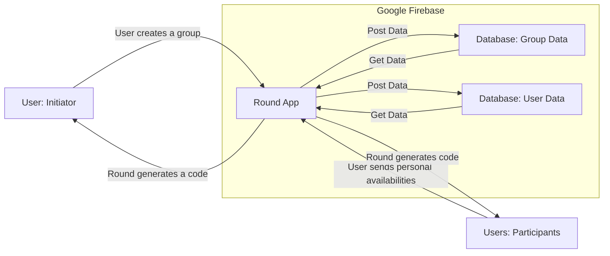

# System Block Diagram

```mermaid
graph LR
    A[User: Initiator]
    B[Users: Participants]
    C[Database: Group Data]
    D[Database: User Data]
    F[Round App]

    A-->|User creates a group|F
    F-->|Round generates a code|A
    B-->|User sends personal availabilities|F
    F-->|Round generates code|B
    subgraph Google Firebase [Google Firebase]
    C-->|Get Data|F
    F-->|Post Data|C
    D-->|Get Data|F
    F-->|Post Data|D
    end
```
