# Design

**Components**

Round is an iOS/Android application that utilizes Google Firebase for the backend, and Flutter for the frontend.

**Algorithms**

Round plans to implement a complex sorting algorithm to generate a static calendar to display the most convenient meetup times for our groups.

**Class Diagrams**
**Diagram 1 - Individual-Related Classes**
```mermaid
classDiagram
    class MyApp{
      -key
      +build(context)
    }

    class HomeScreen{
      +title
      +createState()
    }

    class HomeScreenState{
        +ref
        +initState()
        +logout()
        +build(context)
    }
    
    HomeScreen --> HomeScreenState
    
    class LoginScreen{
      +createState()
    }

    class LoginScreenState{
        -_usernameController
        -_passwordController
        -_isUsernameValid
        -_isPasswordValid
        -_navigateToHomeScreen()
        -_login()
        +build(context)
    }
    
    LoginScreen-->LoginScreenState
    
    class SocialMedia{
      +title
      +databaseReference
      +createState()
    }

    class _SocialMediaState{
        +databaseReference
        +instaSelect
        +fbSelect
        +discordSelect
        +messageSelect
        +snapSelect
        +initState()
        +getData()
        +build(context)
    }
    
    SocialMedia-->_SocialMediaState
    
    class AccountInfo{
        +ref
        +title
        +createState()
    }

    class _AccountInfoState{
        +email
        +name
        +ref
        +initState()
        +getData()
        +build(context)
    }

    AccountInfo-->_AccountInfoState

    class AllGroups{
        +ref
        +title
        +createState()
    }

    class _AllGroupsState{
        +ref
        +uid
        +grabGroups()
        +build(context)
    }

    AllGroups-->_AllGroupsState

    class CodeReception{
        +title
        +createState()
    }

    class _CodeReceptionState{
        -_hash
        -_key
        -_scannedCode
        +data
        +keep
        +one
        +getQR()
        +build(context)
    }

    CodeReception-->_CodeReceptionState

    class CreateAccount{
        +title
        +createState()
    }

    class _CreateAccountState{
        -_emailController
        -_passwordController
        -_fnameController
        -_lnameController
        +ref
        +uid
        +createUserProfile()
        +build()
    }

    CreateAccount-->_CreateAccountState

    class EditAccountInfo{
        +title
        +ref
        +createState()
    }

    class _EditAccountInfoState{
        -firstNameController
        -lastNameController
        -emailController
        +email
        +fName
        +lName
        +ref
        +getData()
        +initState()
        +saveChanges()
        +build()
    }

    EditAccountInfo-->_EditAccountInfoState
    
    MyApp-->MyHomePage
```

**Diagram 2 - Group-related Classes**
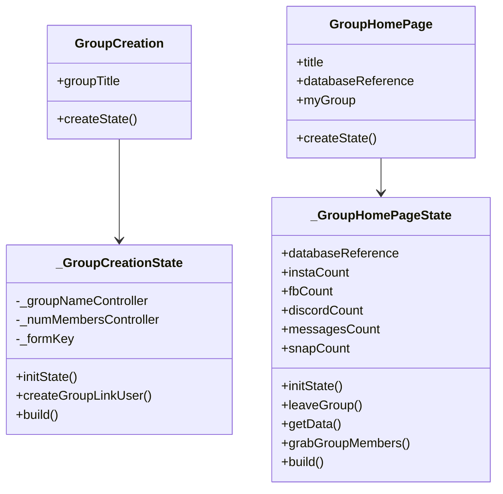

**Diagram 3**
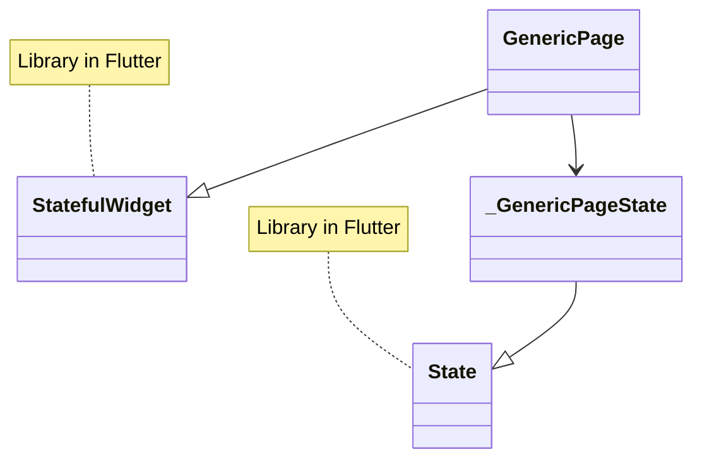

**Sequence Diagrams**
**Use Case 1: Registration**
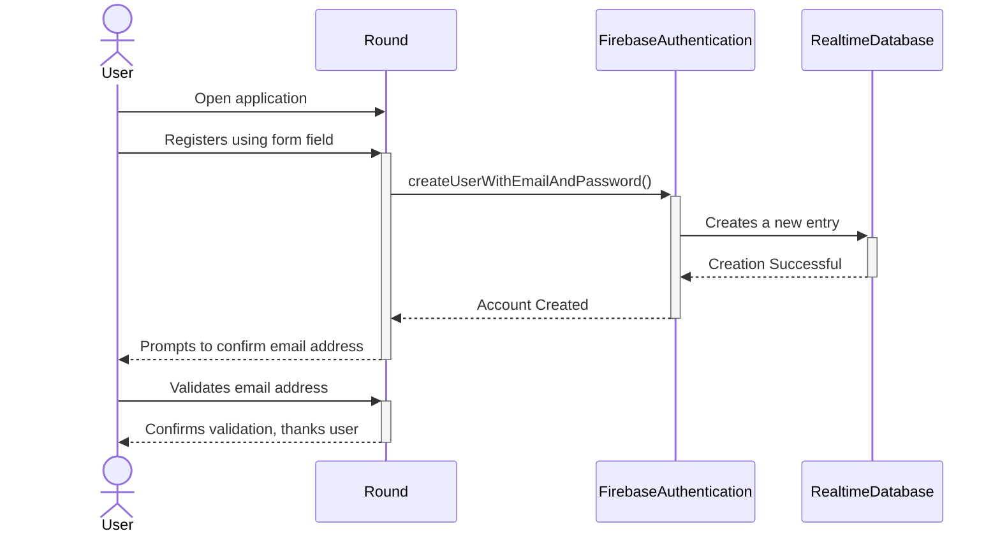
**Use Case 2: Login**
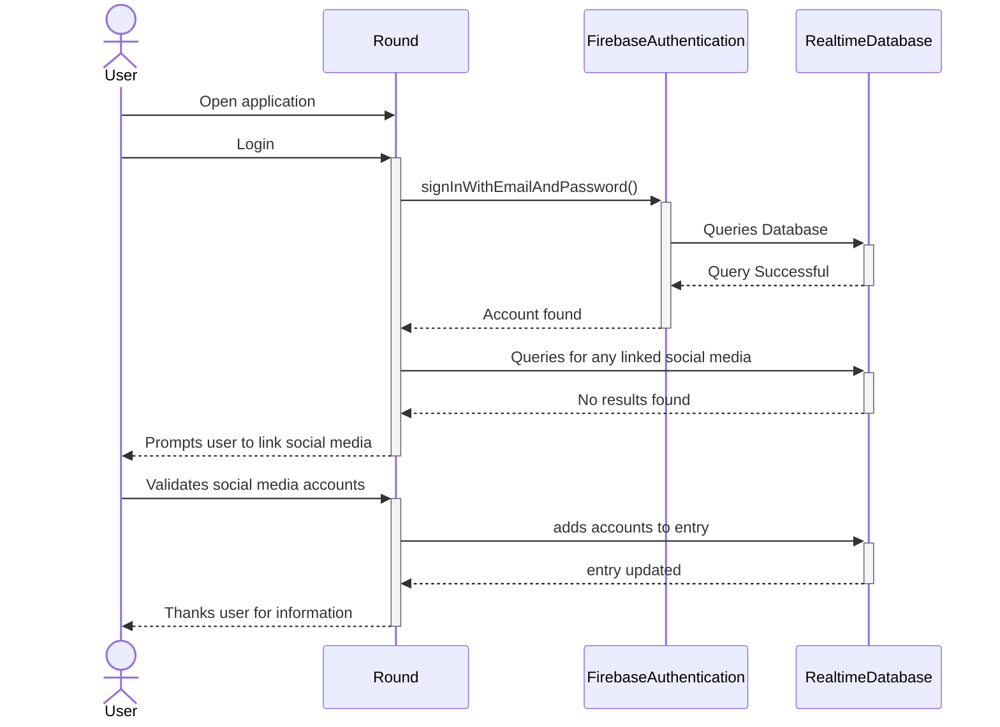
**Use Case 3: Event Creation**
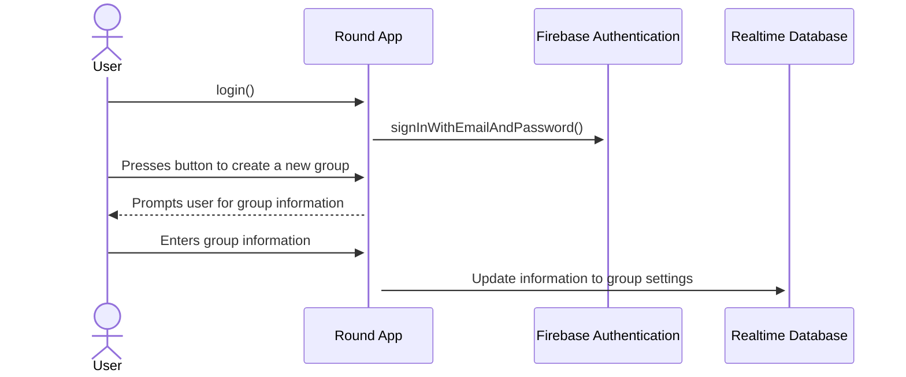
**Use Case 4: Invite Other Users**
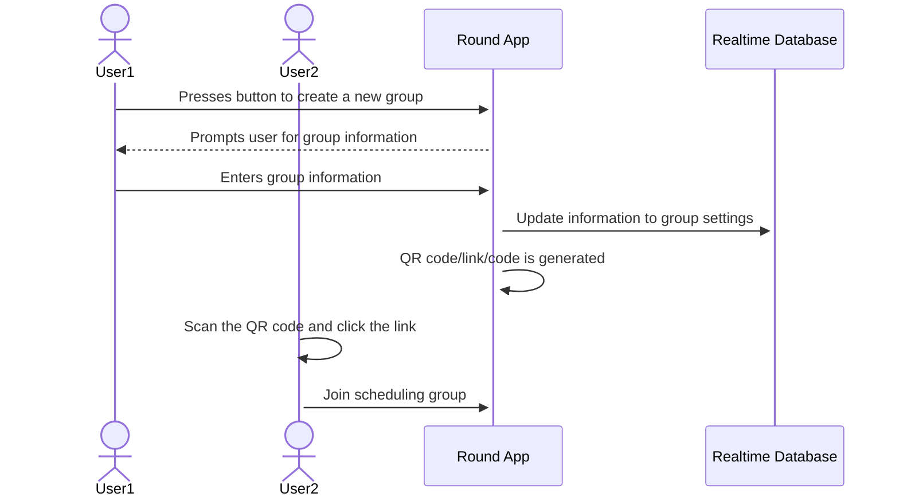
**Use Case 5: Time Block Selection**
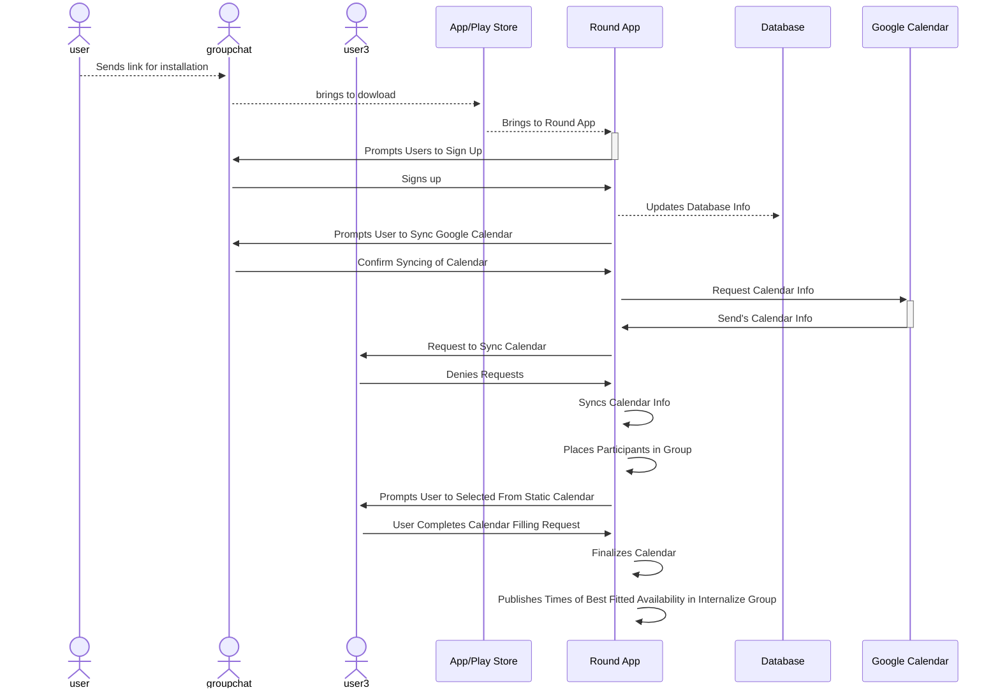
**Use Case 6: Last Second Changes**
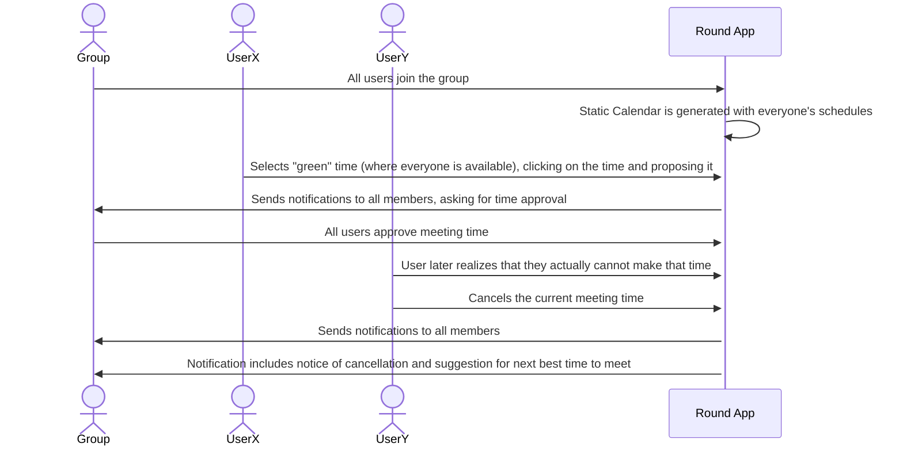
**Use Case 7: Modification of Project Lifespan**
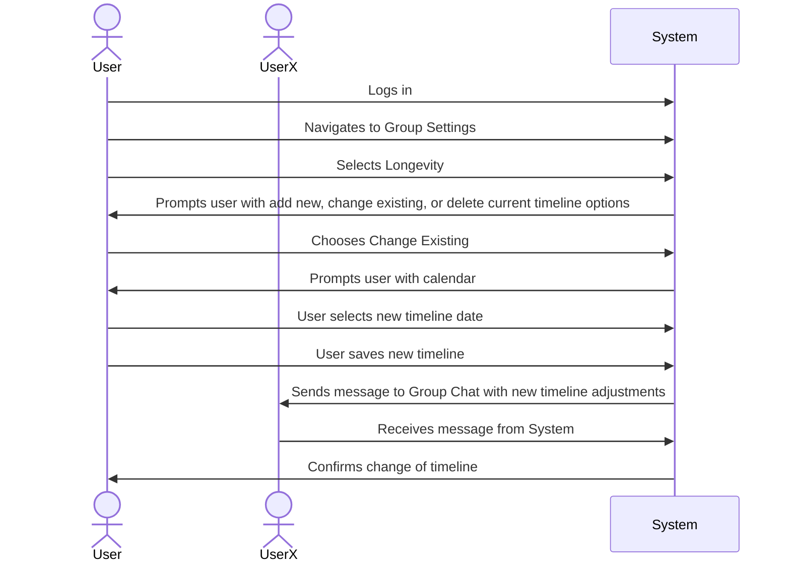
**Use Case 8: Push Notifications and Reminders**
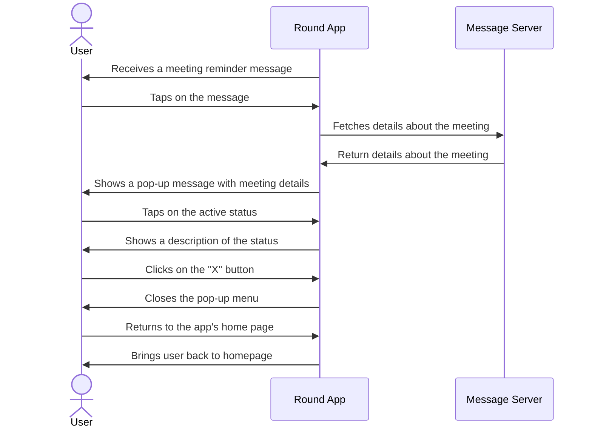
Describe algorithms employed in your project, e.g. neural network paradigm, training and training data set, etc.

If there is a database:

**Entity-relation diagram
```mermaid
erDiagram
    Users{
        string uid 
        string name
        string email    
        Object socialMedia[]
        string teamIds[]
    }
    Teams{
        string teamId 
        string teamName
        string teamAdmin
        string uids[]
    }
    Users }|..|{ Teams: have
   ```

Table design.

A check list for architecture design is attached here [architecture\_design\_checklist.pdf](https://templeu.instructure.com/courses/106563/files/16928870/download?wrap=1 "architecture_design_checklist.pdf")  and should be used as a guidance.
