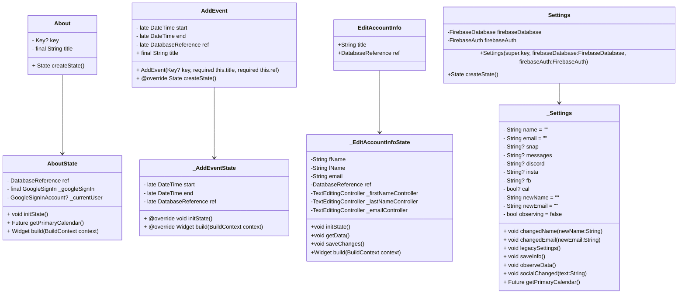

# Design

**Components**

Round is an iOS/Android application that utilizes Google Firebase for the backend, and Flutter for the frontend.

**Algorithms**

Round implements a sorting algorithm to display a non-invasive view of all times a group's members are busy. This will allow them to have a visual representation of general available days/times, without any extra details such as what the event times actually contain (Round only stores the start and end times of each event). Additionally, Round has the capacity to determine the next available time for a potential meeting by using these stored event times as references.

**Class Diagrams**
**Diagram 1 - Classes Related to Calendar Creation, Display, and Integration**


**Diagram 2 - Classes Related to Code Generation, Usage, and Display (both QR and String)**


**Diagram 3 - Classes Related to Group Creation, Display, and Usage**


**Diagram 4 - Classes Related to the Onboarding Process**

**Diagram 5 - Classes Related to User Settings**


**Diagram 6 - Classes Related to the User's Individual Homepage and Usage**
```mermaid

```

**Diagram 7 - Dependencies Between all Classes seen in Diagrams 1-6**
```mermaid

```

**Diagram 8 - General Relationship Between State, StatefulWidget, and the way classes utilize them.**


**Sequence Diagrams**
**Use Case 1: Registration**

**Use Case 2: Login**

**Use Case 3: Event Creation**

**Use Case 4: Invite Other Users**

**Use Case 5: Time Block Selection**

**Use Case 6: Last Second Changes**

**Use Case 7: Modification of Project Lifespan**

**Use Case 8: Push Notifications and Reminders**

Describe algorithms employed in your project, e.g. neural network paradigm, training and training data set, etc.

If there is a database:

**Entity-relation diagram
```mermaid
erDiagram
    Users{
        string uid 
        string name
        string email    
        Object socialMedia[]
        string teamIds[]
    }
    Teams{
        string teamId 
        string teamName
        string teamAdmin
        string uids[]
    }
    Users }|..|{ Teams: have
   ```

Table design.

A check list for architecture design is attached here [architecture\_design\_checklist.pdf](https://templeu.instructure.com/courses/106563/files/16928870/download?wrap=1 "architecture_design_checklist.pdf")  and should be used as a guidance.
